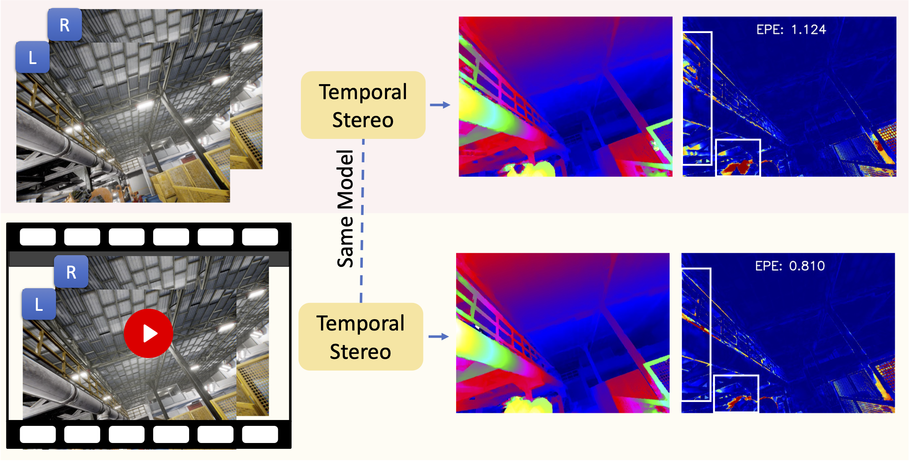

<!-- PROJECT LOGO -->

<p align="center">

  <h1 align="center">TemporalStereo: Efficient Spatial-Temporal Stereo Matching Network</h1>
  <p align="center">
    <a href="https://youmi-zym.github.io"><strong>Youmin Zhang</strong></a>
    ·
    <a href="https://mattpoggi.github.io/"><strong>Matteo Poggi</strong></a>
    ·
    <a href="http://vision.deis.unibo.it/~smatt/Site/Home.html"><strong>Stefano Mattoccia</strong></a>
  </p>
  <!--h2 align="center">Arxiv</h2 -->
  <h3 align="center"><a href="https://arxiv.org/">Arxiv</a> | <a href="https://github.com/youmi-zym/TemporalStereo.git">Project Page</a> | <a href="https://www.youtube.com/watch?v=faSgN2THhEM">Youtube Video</a></h3>
  <div align="center"></div>
</p>
<p align="center">
  <a href="https://www.youtube.com/watch?v=faSgN2THhEM">
    
  </a>
</p>
<p align="center">
<strong>TemporalStereo Architecture</strong>, the first supervised stereo network based on video.
</p>

## Codebase is almost given

Currently, our codebase supports the training on flyingthings3d, while other parts will be ready soon...
Besides, pretrained checkpoints on various datasets are already given, please refer to the following section.

## ⚙️ Setup

Assuming a fresh [Anaconda](https://www.anaconda.com/download/) distribution, you can install the dependencies with:
```shell
conda create -n temporalstereo python=3.8
conda activate temporalstereo
```
We ran our experiments with PyTorch 1.10.1+, CUDA 11.3, Python 3.8 and Ubuntu 20.04.

<!-- We recommend using a [conda environment](https://conda.io/docs/user-guide/tasks/manage-environments.html) to avoid dependency conflicts. -->

#### NVIDIA Apex

We used NVIDIA Apex (commit @ 4ef930c1c884fdca5f472ab2ce7cb9b505d26c1a) for multi-GPU training.

Apex can be installed as follows:

```bash
$ cd PATH_TO_INSTALL
$ git clone https://github.com/NVIDIA/apex
$ cd apex
$ git reset --hard 4ef930c1c884fdca5f472ab2ce7cb9b505d26c1a
$ pip install -v --no-cache-dir --global-option="--cpp_ext" --global-option="--cuda_ext" ./ 
```

#### Detectron2

```bash
python -m pip install 'git+https://github.com/facebookresearch/detectron2.git'
```


#### Cupy

```bash
 # for cuda 11.3, refering to https://docs.cupy.dev/en/stable/install.html
pip install cupy-cuda113
```

#### Finally

```bash
pip install -r requirements.txt
```

## 💾 Datasets
We used three datasets for training and evaluation.

#### Flyingthings3D

The [Flyingthings3D/SceneFlow](https://lmb.informatik.uni-freiburg.de/resources/datasets/SceneFlowDatasets.en.html) can be downloaded here.

After that, you will get a data structure as follows:

```
FlyingThings3D
├── disparity
│    ├── TEST
│    ├── TRAIN
└── frames_finalpass
│    ├── TEST
│    ├── TRAIN
```

#### KITTI 2012/2015

Processed KITTI 2012/2015 dataset and KITTI Raw Sequences can be downloaded [here:comming soon]().


#### TartanAir

Processed TartanAir dataset can be downloaded [here:comming soon]().

## ⏳ Training

Note: batch size is set for each GPU

```bash
$ cd THIS_PROJECT_ROOT/projects/TemporalStereo

# sceneflow
python dist_train.py --config-file ./configs/sceneflow.yaml
```

During the training, tensorboard logs are saved under the experiments directory. To run the tensorboard:

```bash
$ cd THIS_PROJECT_ROOT/
$ tensorboard --logdir=. --bind_all
```

Then you can access the tensorboard via http://YOUR_SERVER_IP:6006

### Checkpoints

Pretrained checkpoints on various datasets are all available [here](https://drive.google.com/drive/folders/1dbOfdx6BQ6cRX_m-G4kvvji30uKJOqMH?usp=sharing).

## 📊 Testing

```bash
$ cd THIS_PROJECT_ROOT/projects/TemporalStereo
# please remember to modify the parameters according to your case

# run a demo
./demo.sh

# submit to kitti
./submit.sh

# inference on a video
./video.sh

```

## 👩‍⚖️ Acknowledgement
Thanks the authors for their works:

[AcfNet](https://github.com/DeepMotionAIResearch/DenseMatchingBenchmark), [CoEx](https://github.com/antabangun/coex), [Detectron2](https://github.com/facebookresearch/detectron2.git)


## Citation

If you find our work useful in your research please consider citing our paper:

```
@inproceedings{Zhang2023TemporalStereo,
      title     = {TemporalStereo: Efficient Spatial-Temporal Stereo Matching Network},
      author    = {Zhang, Youmin and Poggi, Matteo and Mattoccia, Stefano},
      booktitle = {IROS},
      year      = {2023}
  }
```